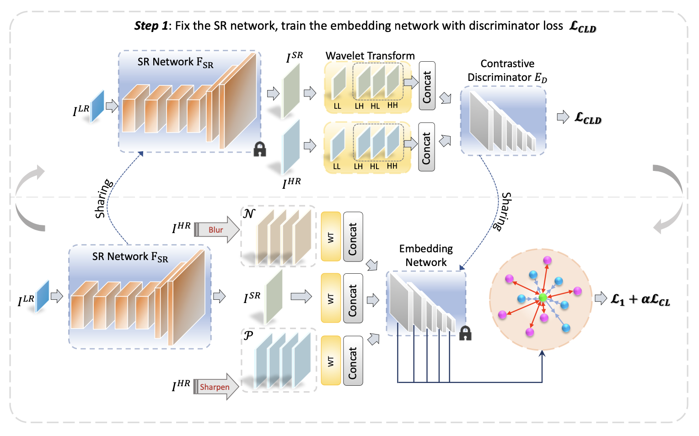

# PCL-SISR
Pytorch Implementation of PCL-SISR.

## Framework

## Train
### Prepare training data 

Download DIV2K training data (800 training + 100 validtion images).
For more informaiton, please refer to [EDSR(PyTorch)](https://github.com/thstkdgus35/EDSR-PyTorch) and [RCAN](https://github.com/yulunzhang/RCAN). 

### Begin to train

We adopt their official implementations in [EDSR(PyTorch)](https://github.com/thstkdgus35/EDSR-PyTorch), [RCAN](https://github.com/yulunzhang/RCAN) and [HAN](https://github.com/wwlCape/HAN).

Our contrastive loss with a GAN-like framework is implemented in [src/loss/adversarial.py](https://anonymous.4open.science/r/ECL-SISR-8B94/src/loss/adversarial.py) and VGG-based contrastive loss is in [src/loss/cl.py](https://anonymous.4open.science/r/ECL-SISR-8B94/src/loss/cl.py).

To reproduce our results, please take our code to their official implementations and re-train.

More methods and other low-level tasks will be tested in the future.

## Test

We use the scripts in [RCAN](https://github.com/yulunzhang/RCAN) to build benchmark datasets and more information can be found in [RCAN](https://github.com/yulunzhang/RCAN).

Our pre-trained models are released, please download from [Google Drive](https://drive.google.com/drive/folders/1iS_2WSt9k1Z6YoP_-EFnXMmUcn7lim3d?usp=sharing) and test respectively.

## Results

Some examples are shown.

## Acknowledgements
We thank the authors for sharing their codes of  [EDSR (PyTorch)](https://github.com/thstkdgus35/EDSR-PyTorch), [RCAN](https://github.com/yulunzhang/RCAN) and [HAN](https://github.com/wwlCape/HAN).