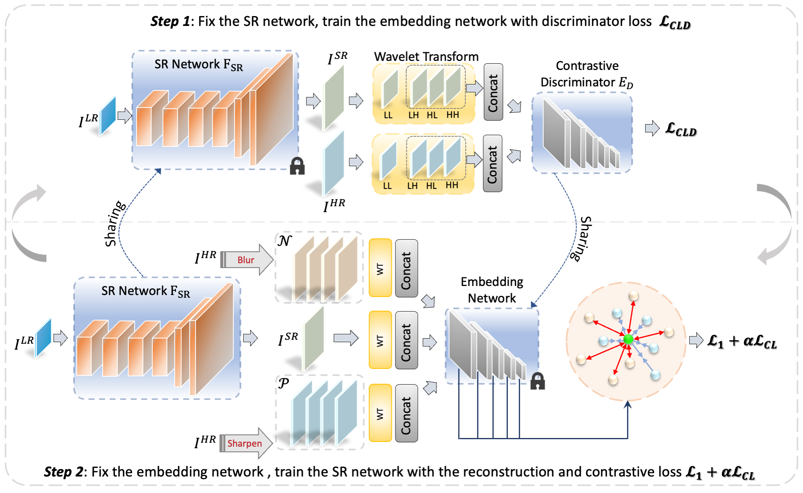
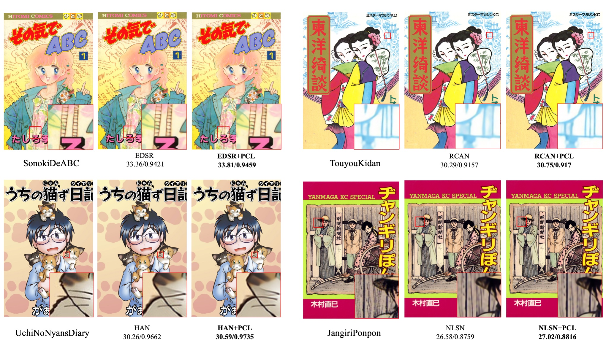
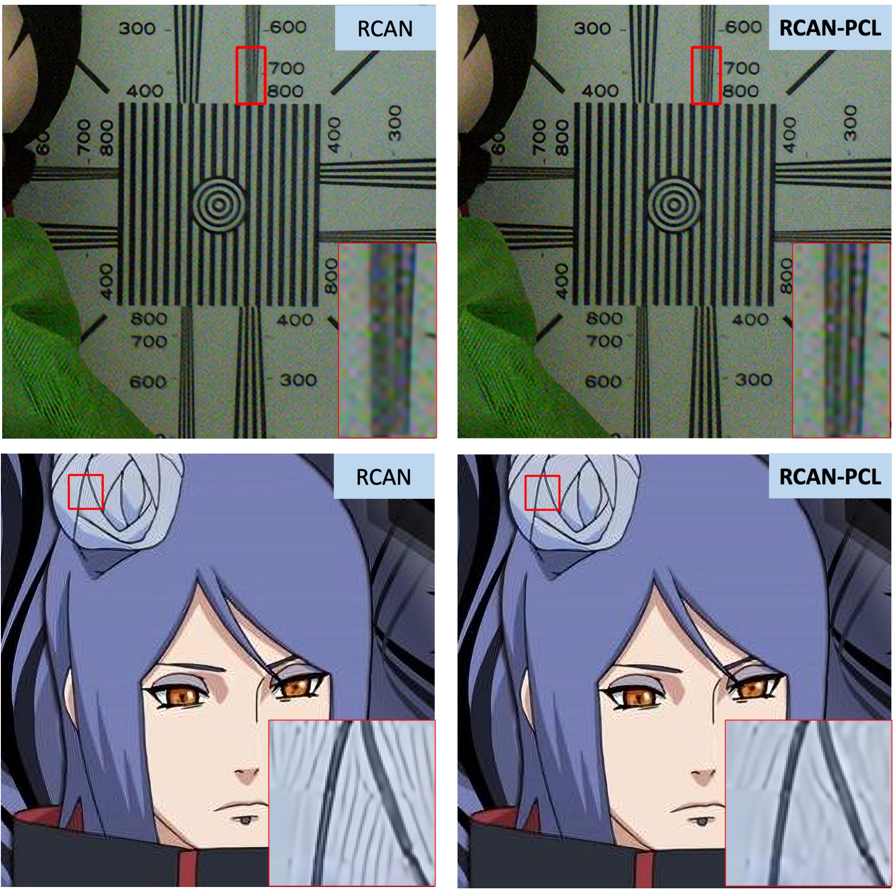

<div align="center">

# A Practical Contrastive Learning Framework for Single-Image Super-Resolution

<a href="https://ieeexplore.ieee.org/abstract/document/10176303"> </a>
<a href="https://arxiv.org/abs/2111.13924"> </a>
<a href="https://hits.sh/github.com/Aitical/PCL-SISR/"></a>

</div>

## News

🔥 You may be interested in our new work 
1. [**Learning from History: Task-agnostic Model Contrastive Learning for Image Restoration**](https://arxiv.org/abs/2309.06023), accepted by AAAI 24
2. [**Exploiting Self-Supervised Constraints in Image Super-Resolution**](https://arxiv.org/abs/2404.00260v1), to be appeared in ICME 24 Oral.
## Cication
```
@ARTICLE{10176303,
  author={Wu, Gang and Jiang, Junjun and Liu, Xianming},
  journal={IEEE Transactions on Neural Networks and Learning Systems}, 
  title={A Practical Contrastive Learning Framework for Single-Image Super-Resolution}, 
  year={2023},
  volume={},
  number={},
  pages={1-12},
  doi={10.1109/TNNLS.2023.3290038}}
```

## Overview
> Contrastive learning has achieved remarkable success on various high-level tasks, but there are fewer contrastive learning-based methods proposed for low-level tasks. It is challenging to adopt vanilla contrastive learning technologies proposed for high-level visual tasks to low-level image restoration problems straightly. Because the acquired high-level global visual representations are insufficient for low-level tasks requiring rich texture and context information. In this paper, we investigate the contrastive learning-based single image super-resolution from two perspectives: positive and negative sample construction and feature embedding. The existing methods take naive sample construction approaches (e.g., considering the low-quality input as a negative sample and the ground truth as a positive sample) and adopt a prior model (e.g., pre-trained VGG model) to obtain the feature embedding. To this end, we propose a practical contrastive learning framework for SISR, named PCL-SR. We involve the generation of many informative positive and hard negative samples in frequency space. Instead of utilizing an additional pre-trained network, we design a simple but effective embedding network inherited from the discriminator network which is more task-friendly. Compared with existing benchmark methods, we re-train them by our proposed PCL-SR framework and achieve superior performance. Extensive experiments have been conducted to show the effectiveness and technical contributions of our proposed PCL-SR thorough ablation studies.
<div style="text-align: center">

</div>


## Train
### Prepare training data 

Download DIV2K training data (800 training + 100 validtion images).
For more informaiton, please refer to [EDSR(PyTorch)](https://github.com/thstkdgus35/EDSR-PyTorch) and [RCAN](https://github.com/yulunzhang/RCAN). 


### Begin to train

We adopt their official implementations in [EDSR(PyTorch)](https://github.com/thstkdgus35/EDSR-PyTorch), [RCAN](https://github.com/yulunzhang/RCAN) and [HAN](https://github.com/wwlCape/HAN).

Our contrastive loss with a GAN-like framework is implemented in [src/loss/adversarial.py](https://github.com/Aitical/PCL-SISR/src/loss/adversarial.py) and VGG-based contrastive loss is in [src/loss/cl.py](https://github.com/Aitical/PCL-SISR/src/loss/cl.py).

To reproduce our results, please take our code to their official implementations and re-train.

More methods and other low-level tasks will be tested in the future.

## Test

Test datasets can be found in [EDSR(PyTorch)](https://github.com/thstkdgus35/EDSR-PyTorch). PSNR and SSIM metric scripts can be found in [here](https://github.com/greatlog/DAN/tree/master/metrics).

Our pre-trained models are released, please download from [Google Drive](https://drive.google.com/drive/folders/1iS_2WSt9k1Z6YoP_-EFnXMmUcn7lim3d?usp=sharing) and test respectively.

## Results

Main results.


Some examples are presented.

Urban100 Samples
<div style="text-align: center">

</div>

Manga109 Samples

<div style="text-align: center">

</div>


Robust to ResSRSet
<div style="text-align: center">

</div>


## Acknowledgements
We thank the authors for sharing their codes of  [EDSR (PyTorch)](https://github.com/thstkdgus35/EDSR-PyTorch), [RCAN](https://github.com/yulunzhang/RCAN), [HAN](https://github.com/wwlCape/HAN), and [NLSN](https://github.com/HarukiYqM/Non-Local-Sparse-Attention).


