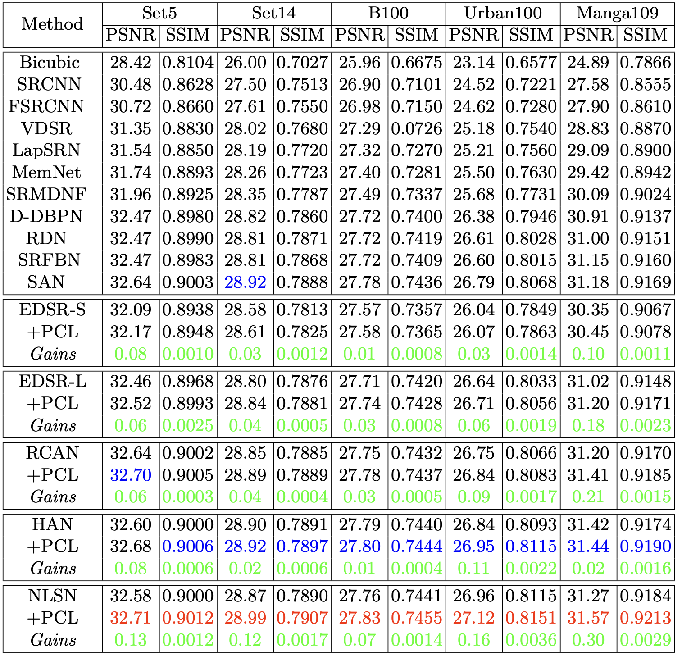
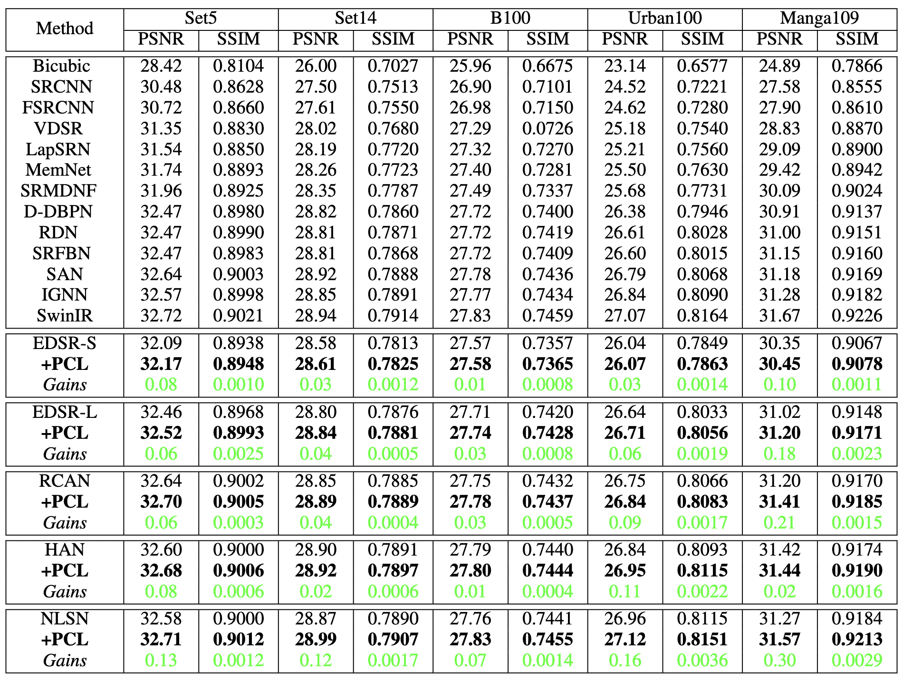
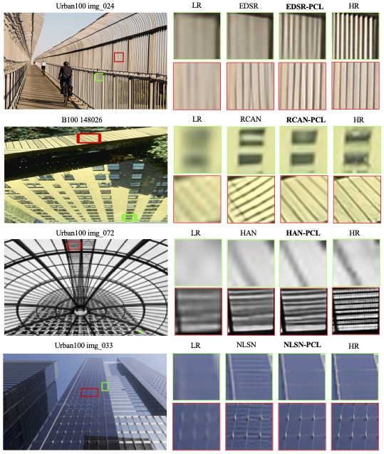
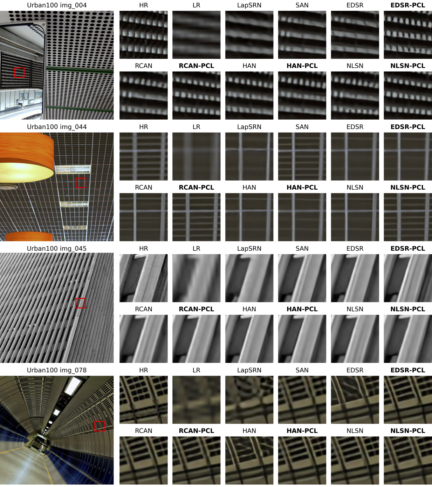

# PCL-SISR
Our Pytorch Implementation of PCL-SISR.
```
@article{DBLP:journals/corr/abs-2111-13924,
  author    = {Gang Wu and
               Junjun Jiang and
               Xianming Liu and
               Jiayi Ma},
  title     = {A Practical Contrastive Learning Framework for Single Image Super-Resolution},
  journal   = {CoRR},
  volume    = {abs/2111.13924},
  year      = {2021}
}
```

## Framework


## Train
### Prepare training data 

Download DIV2K training data (800 training + 100 validtion images).
For more informaiton, please refer to [EDSR(PyTorch)](https://github.com/thstkdgus35/EDSR-PyTorch) and [RCAN](https://github.com/yulunzhang/RCAN). 


### Begin to train

We adopt their official implementations in [EDSR(PyTorch)](https://github.com/thstkdgus35/EDSR-PyTorch), [RCAN](https://github.com/yulunzhang/RCAN) and [HAN](https://github.com/wwlCape/HAN).

Our contrastive loss with a GAN-like framework is implemented in [src/loss/adversarial.py](https://github.com/Aitical/PCL-SISR/src/loss/adversarial.py) and VGG-based contrastive loss is in [src/loss/cl.py](https://github.com/Aitical/PCL-SISR/src/loss/cl.py).

To reproduce our results, please take our code to their official implementations and re-train.

More methods and other low-level tasks will be tested in the future.

## Test


Test datasets can be found in [EDSR(PyTorch)](https://github.com/thstkdgus35/EDSR-PyTorch). PSNR and SSIM metric scripts can be found in [here](https://github.com/greatlog/DAN/tree/master/metrics).

Our pre-trained models are released, please download from [Google Drive](https://drive.google.com/drive/folders/1iS_2WSt9k1Z6YoP_-EFnXMmUcn7lim3d?usp=sharing) and test respectively.

## Results

Main results.




Some examples are shown.




Comparison with more approaches with detail textures.




## Acknowledgements
We thank the authors for sharing their codes of  [EDSR (PyTorch)](https://github.com/thstkdgus35/EDSR-PyTorch), [RCAN](https://github.com/yulunzhang/RCAN), [HAN](https://github.com/wwlCape/HAN), and [NLSN](https://github.com/HarukiYqM/Non-Local-Sparse-Attention).


